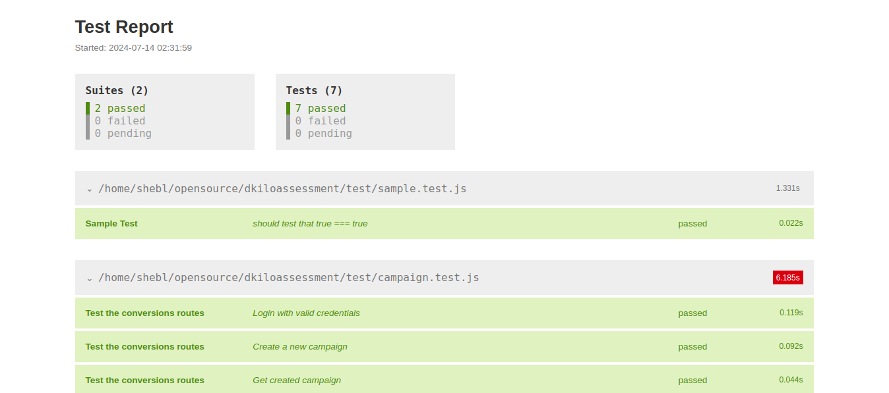
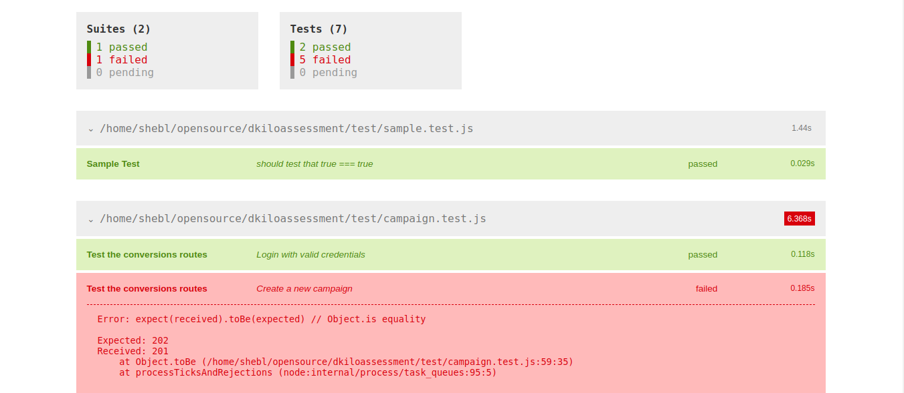
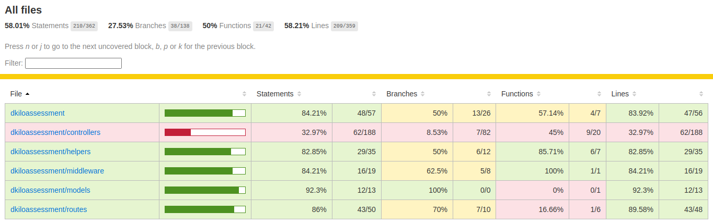
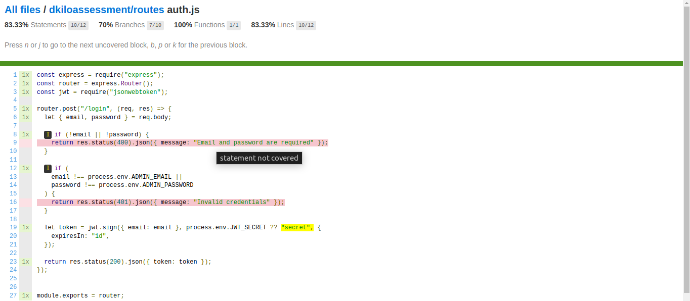
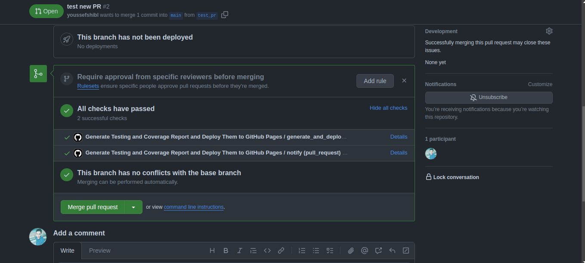
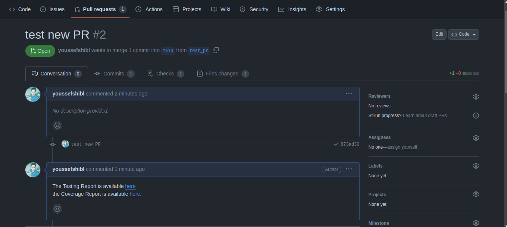
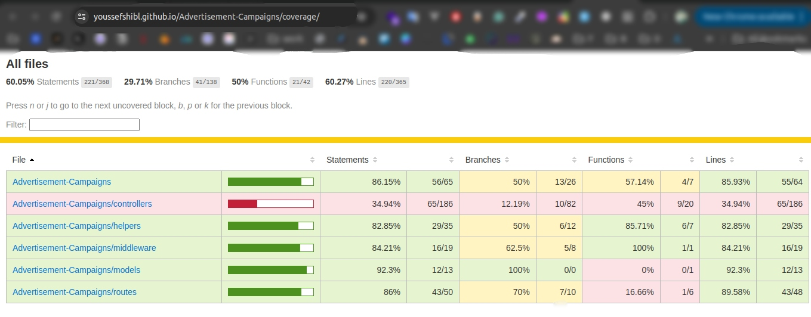
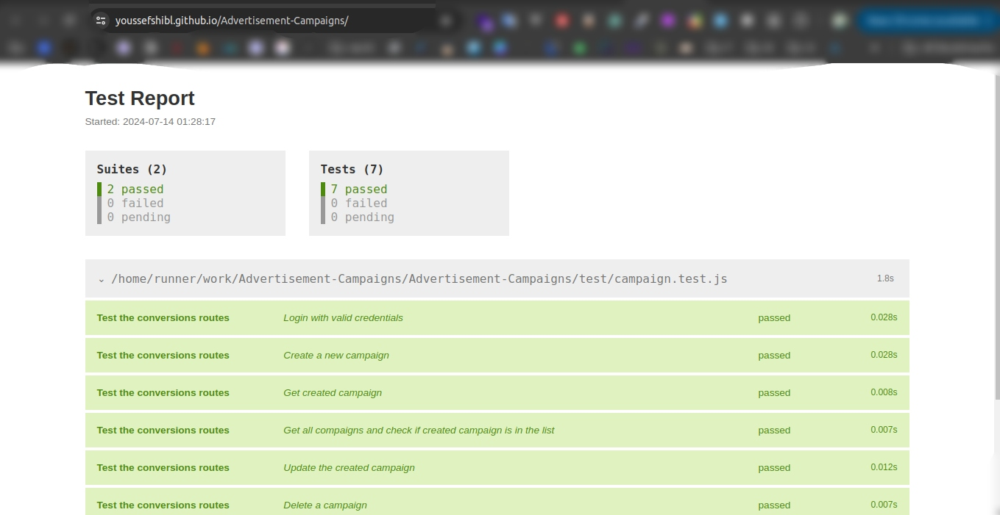

# 🛸 Backend Service For Measuring Conversions for Advertisement Campaigns

backend solution for tracking and measuring conversions for advertisement campaigns using QR
codes , include generating QR codes linked to specific campaigns, tracking scans, and
measuring conversions

## 🚀 Architecture


## 🔥 Features

1. Create a campaign with a name and a target info (URL, phone number, etc) (update, delete, get all, get by id)
2. Generate a QR code for the campaign
3. Track the scans of the QR code and save the information in the database like the user agent, the time of the scan, and the location of the scan
4. Redirect the user to the target URL or the app which related to the campaign
5. Track the user's behavior in the company's website or app and measure the conversion rate
6. Export Statistics of the campaign related scans like the number of scans from each country, the number of scans from each device, the number of scans from each browser, and the number of scans from each OS
7. protect the service from the `DDOS` attack by using `Rate Limiting` and use helmets to protect the service from `XSS` and `CSRF` attacks by setting the collection of headers

## 🔫 Flow of the service

1. User creates a campaign with a name and a target info (URL, phone number, etc)
2. User generates a QR code for the campaign
   - Get id of the campaign
   - Get URL which related to the campaign
   - Generate QR code with the URL
   - Shares the QR code with Users
3. User scans the QR code
4. QR code scanner sends a request to the backend Service with the campaign id
5. Backend Service Save the information of the scan in the database
6. Backend Service check the agent of the request
   - If the agent is a browser, redirect the user to the target URL
   - If the agent is a mobile app, redirect the user to App which related to the campaign
   - this redirection contain uuid of the user which scanned the QR code and the token of this user
7. After user redirected to the company's website or app, the company can track the user's behavior and measure the conversion rate
8. Any Event happens in the company's website or app, the company can send this event to the backend service with the uuid of the user and token of the user for authentication which stored in the redis to make service `stateless`

## 🧊 Demo

[](https://github.com/user-attachments/assets/60880743-2271-4109-be3e-d19e25a473cd)

1. Run `start.sh` to start the service this will start the following services
   - MongoDB container
   - Redis container
   - Clean the database and insert dummy data `seeds`
   - Start Frontend services one for generating QR code and the other is web app for the company

> **_NOTE:_**  before running the `start.sh` script you should make sure that you set right environment variables in the `.env` file specially the `QRCODE_ENDPOINT` which is the endpoint of the QR code service to can access it from any other device in local network in mobile case you should set it by the ip of the server in the local network like `192.168.1.6`

## 💉 Set Environment Variables

your environment variables should be like this

```bash
SERVICE_NAME=AdvertisementCampaignsService
SERVICE_VERSION=1.0.0
SERVICE_HOST=0.0.0.0
SERVICE_PORT=8000
SERVICE_BASE_PATH=/api/v1
SERVICE_MODE=development
SERVICE_LOG_DIR=logs
SERVICE_LOG_FILE=access.log
MONGO_DB_HOST=127.0.0.1
MONGO_DB_PORT=27017
MONGO_DB_NAME=advertisements
MONGO_DB_USER=root
MONGO_DB_PASS=rootpassword
ADMIN_EMAIL=youssef@gmail.com
ADMIN_PASSWORD=123456
JWT_SECRET=secret
QRCODE_ENDPOINT=http://192.168.1.3:8000/api/v1/qrcode/redirection
ADECOMPANY_ENDPOINT=http://127.0.0.1:8002
REDIS_HOST=127.0.0.1
REDIS_PORT=6379
```

we can explain the environment variables as follows

- `SERVICE_NAME` : the name of the service
- `SERVICE_VERSION` : the version of the service
- `SERVICE_HOST` : the host of the service
- `SERVICE_PORT` : the port of the service
- `SERVICE_BASE_PATH` : the base path of the service
- `SERVICE_MODE` : the mode of the service `development` or `production`
- `SERVICE_LOG_DIR` : the directory of the logs
- `SERVICE_LOG_FILE` : the name of the log file
- `MONGO_DB_HOST` : the host of the MongoDB
- `MONGO_DB_PORT` : the port of the MongoDB
- `MONGO_DB_NAME` : the name of the MongoDB database
- `MONGO_DB_USER` : the user of the MongoDB
- `MONGO_DB_PASS` : the password of the MongoDB
- `ADMIN_EMAIL` : the email of the admin
- `ADMIN_PASSWORD` : the password of the admin
- `JWT_SECRET` : the secret of the JWT
- `QRCODE_ENDPOINT` : the endpoint of the QR code service
  - because i run service with local i should run server is `0.0.0.0` to make it accessible from wan network so this end point is ip of the server in wan network you can get it by `ip a s` command
- `ADECOMPANY_ENDPOINT` : the endpoint of the campaign company service we make it as demo in `frontend/ade_company_web` directory

# 🔦 [Postman API Documentation](https://documenter.getpostman.com/view/20246655/2sA3e5eojN#9a4bfb2e-766e-477f-99fd-407fce6073c4)

flow of endpoints and how to use them

1. Authentication endpoints to get token `Auth/get jwt token`
2. Campaigns endpoint to create new campaign, get all campaigns, get campaign by id, update campaign, delete campaign `Campaigns/*`
3. QR code endpoint to generate QR code for the campaign `qr code /gerate`
4. Scans endpoint to track the scans of the QR code `qr code /redirection`
5. track the user's behavior in the company's website or app and measure the conversion rate `Conversions/push` `Conversions/fetch`
6. Statistics endpoint to get statistics of the campaign related scans `Statistics/*`

## 🧪 Testing

we can run the tests by running the following command

```bash
npm run test
```

and for genrate testing coverage report we can run the following command for `cobertura` report and `text` report we can use this report to integrate with `Codecov` or `SonarQube`

```bash
npm run test:cov
```

and if we want generate static html coverage report we can run the following command

```bash
npm run test:cov:html
```

#### testing files

1.`sample.test.js` : this file for testing that packge is installed correctly 2.`campaigns.test.js` : this file for testing the campaigns endpoints

- login as admin
- get token
- create campaign
- get all campaigns
- get campaign by id
- update campaign
- delete campaign

> **_NOTE:_** we can make the tests more complex by adding more test cases and more edge cases to cover all the scenarios and make automated testing for the service using cybress or selenium but we dont have enough time to do that

<p float="left">
  
   
</p>

<p float="left">
  
   
</p>


## 🚧 Testing Github Action pipeline 
every PR into main branch in repository will trigger the github action pipeline to run the tests and generate testing & coverage reports and deploy the repository to github pages to make developers can access testing reports and coverage reports

> **_NOTE:_**  developers can access the testing reports and coverage reports by clicking in here in comment which will add automatically by the github action pipeline after the pipeline is done and the reports are generated


<p float="left">
  
   
</p>

<p float="left">
  
   
</p>

## 🔋 Logs

we can use `morgan` to log the requests and the responses of the service , logs will be like
```bash
::ffff:127.0.0.1 - - [14/Jul/2024:00:46:40 +0000] "GET /api/v1/campaigns/66931ff01dc80e69c9640103 HTTP/1.1" 200 495 "-" "-"
::ffff:127.0.0.1 - - [14/Jul/2024:00:46:40 +0000] "GET /api/v1/campaigns HTTP/1.1" 200 497 "-" "-"
::ffff:127.0.0.1 - - [14/Jul/2024:00:46:40 +0000] "PUT /api/v1/campaigns/66931ff01dc80e69c9640103 HTTP/1.1" 200 513 "-" "-"
::ffff:127.0.0.1 - - [14/Jul/2024:00:46:40 +0000] "DELETE /api/v1/campaigns/66931ff01dc80e69c9640103 HTTP/1.1" 204 - "-" "-"
```
in future we can use `Winston` to log the requests and the responses of the service and we can use `Elasticsearch` to store the logs and use `Kibana` to visualize the logs

## 📦 Compnents

- MongoDB : to store the data of the campaigns and the scans but why we use MongoDB because it is `NoSQL` database and we can store the data in `JSON` format and we can store the data of the scans in the same collection of the campaigns to make the service `stateless` and we can use the `aggregation` to get the statistics of the scans and for heavy write operations we can use `sharding` to distribute the data on multiple servers in hight scale applications as well as our system is write heavt so mongo is the best choice for this system because it is `schemaless` and we can store the data in `JSON` format

- Redis : to store the tokens of the users and the uuid of the users to make the service `stateless` and in future we can use the `pub/sub` to send the events from the company's website or app to the backend service as well as the events that will be send from the company's website or app will be high rate and we should authenticate user for every event so we should use memory database to store the tokens and the uuid of the users to speed read operations for check the authentication of the user 


## 💉 Database schema

we have two collections in the database

1. `campaigns` : to store the data of the campaigns
2. `scans` : to store the data of the scans of the QR code
3. `conversions` : to store the data of the conversions of the users

```json
{
  "campaigns": {
    "name": "string",
    "description": "string",
    "status": "active|inactive",
    "startDate": "date",
    "endDate": "date",
    "budget": "number",
    "web": {
      "url": "string"
    },
    "mobile": {
      "deeplink": "string"
    },
    "createdAt": "date",
    "updatedAt": "date"
  },
  "scans": {
    "campaignId": "string",
    "uuid": "string",
    "scannedAt": "string",
    "ip": "string",
    "location": {
      "country": "string",
      "range": "string",
      "region": "string",
      "eu": "string",
      "timezone": "string",
      "city": "string",
      "ll": ["number", "number"],
      "metro": "number",
      "area": "number"
    }
  },
  "conversions": {
    "uuid": "string",
    "event": "string",
    "createdAt": "date"
  }
}
```

## 🐳 Docker
to make backend service is easy to deploy on any server include cloud services like `AWS` or `Azure` or `GCP` we can use `Docker` to make the service is `containerized` and we can use `docker-compose` to make the service is `orchestrated` and we can use `Kubernetes` to make the service is `scalable` and `resilient`

to build the docker image we can run the following command

```bash
docker build -t advcompanyservice .
```

to run the docker container we can run the following command

```bash
docker run -it --rm -p 8000:8000 -v ${PWD}/.env.docker:/usr/src/app/.env advcompanyservice
```
> **_NOTE:_**  the `.env.docker` file is same `.env` file but change mongodb host & redis host to my local ip address to make docker container can access the mongodb and redis

## 	🚀 Statistics
the statistics of the scans of the QR code will be stored in the database and we can get the statistics by the following steps
```json
{
  "total": 20,
  "location": {
    "KW": 5,
    "GN": 5,
    "NE": 2,
    "KY": 10,
  },
  "operatingSystem": {
    "iOS": 5,
    "Windows": 9,
    "Linux": 4,
    "Android": 2
  },
  "device": {
    "Smartphone": 5,
    "Tablet": 3,
    "Mobile": 3,
    "iPhone": 5,
    "iPad": 2,
    "Laptop": 2
  }
}
```


## ❌ Future problems

1. Big data in the database specially in conversions collection so this will make the service slow when read the data from the database which related with specific user so we can solve this by indexing the data in the database and use `sharding` to distribute the data on multiple servers
2. High rate of the events that will be sent from the company's website or app to the backend service so we can solve this by using `pub/sub` to send the events to the backend service and use `redis` to store the tokens and the uuid of the users to make the service `stateless`

## 🛩️ Future Plans
1. Add more tests for the service
2. Add logs for the service using `Winston`
3. Make github actions pipeline for Build Docker image and push it to the docker hub
4. Make github actions pipeline for deploy the service to the kubernetes cluster
5. Make the service is `scalable` and `resilient` by using `Kubernetes`
6. Make the service is `monitorable` by using `Prometheus` and `Grafana`
7. Make the service is `secure` by using `Istio` and `Opa`

## 📦 Technologies

- Node.js + express.js
- Jest + Supertest
- MongoDB
- Redis
- Docker
- Bash Scripting
- Helmets
- Rate Limiting
- JWT
- QR code generator
- Morgan ( Logger )


